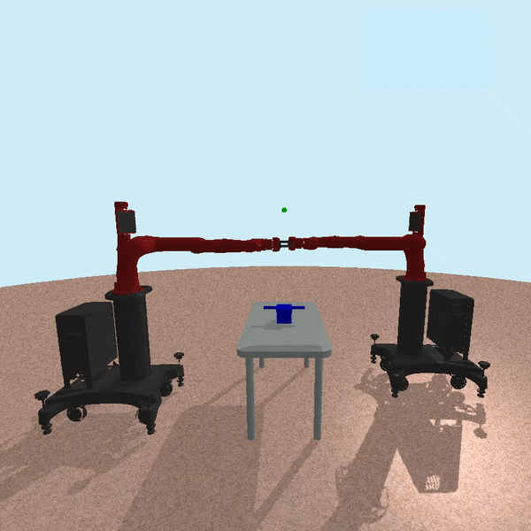

# Collaborative Gym (v0)
Collaborative Gym is an open-source physics-based simulation framework for multi-robot interaction which focuses on modeling the interaction between multiple robots.


As well as directly integrating into the PyBullet physics engine, Collaborative Gym environments utilize the OpenAI Gym interface. 


<br><br>
## **Contents**
- [Trained Tasks Showcase](#trained-tasks-showcase)
- [Install](#install)
- [Overview](#overview)
    - [OpenAI Gym](#openai-gym)
    - [Ray Rllib](#ray-rllib)
- [Create a Custom Environment](#create-a-custom-environment)
    - [Simple Example](#simple-example)


<br><br>
## Trained Tasks Showcase
Here are side-by-side videos of untrained and trained available tasks:

| Untrained Task | Trained Task |
|:--------------:|:------------:|
| Poke Sawyer-Sawyer |  |
Poke Panda-Sawyer | 
Lift Sawyer-Sawyer | 
Lift Jaco-Jaco | 
Balance Sawyer-Sawyer | 
Balance Jaco-Sawyer | 
Pass Sawyer-Sawyer | 
Pass Jaco-Sawyer | 

## Install
In order to avoid package dependency conflicts, it is recommended that Collaborative Gym be installed in a virtual environment. The following instructions are designed specifically for Ubuntu and MacOS, although the equivalent commands will work on Windows as well.

``` 
python3 -m pip install --user virtualenv
python3 -m venv venv
source venv/bin/activate
pip3 install --upgrade pip
git clone https://github.com/gabriansa/collaborative-gym
cd collaborative-gym
pip3 install -e .
```

## Overview
The correct installation can be tested by visualizing an existing Collaborative environment. In the following environment, two Sawyer robots must coordinate in order to insert the stick into the donut.

```
python3 -m collaborative_gym --env "PokeTaskSawyers-v0"
```


A few variations of each environment with different robots are available. 

```
python3 -m collaborative_gym --env "PokeTaskPandaSawyer-v0"
```


Here is a list of all environments and their existing variations with 4 different collaborative tasks and
3 commercial robots (Jaco, Sawyer, Panda):

| Environment Name | Robots Utilized| Preview |
| --- | --- | --- |
| `PokeTaskSawyers-v0` | Sawyer-Sawyer | |
| `PokeTaskPandaSawyer-v0` | Panda-Sawyer | |
| `LiftTaskSawyers-v0` | Sawyer-Sawyer | |
| `LiftTaskJacos-v0` | Jaco-Jaco | |
| `BalanceTaskSawyers-v0` | Sawyer-Sawyer | |
| `BalanceTaskJacoSawyer-v0` | Jaco-Sawyer | |
| `PassTaskSawyers-v0` | Sawyer-Sawyer | |
| `PassTaskJacoSawyer-v0` | One Jaco and one Sawyer | |


### OpenAI Gym
As Collaborative Gym is based on the OpenAI Gym framework, an environment can be accessed as follows:

```
import collaborative_gym
import gym

# Function to sample actions for each robot
def sample_action(env):
    action = {}
    for robot_name, robot in env.my_robots.items():
        action[robot_name] = env.action_space_robot[robot_name].sample()
    return action

env = gym.make('BalanceTaskSawyers-v0')

# Reset the environment
done = False
env.render()
observation = env.reset()
while not done:
    # Step the simulation forward. Have the robots take random actions
    observation, reward, done, info = env.step(sample_action(env))
    if type(done) is dict:
        done = done['__all__']
env.disconnect()
```

### Ray Rllib
Through the use of Ray RLlib, Collaborative Gym provides built-in functions which facilitate the training and evaluation of Reinforcement Learning (RL) policies. These functions are available in `ray_util.py`. Currently, proximal policy optimization (PPO) is used for all environments, but different optimization methods can be implemented by modifying `ray_util.py` and `ray_training_config.py`.

**Train an Environment**\
In order to train an enviornment using the Rlllib funcitonalities it is possible to call the following command:
```
python3 -m collaborative_gym.ray_util --env "LiftTaskSawyers-v0" --algo ppo --train --train-timesteps 100000 --save-dir ./ray_trained_models/
```
Some pretrained polciies for a few environmentes are available in the folder `ray_trained_models`.


**Resume Training Environment**\
The following command can be used to resume training (or fine-tune) an existing policy:
```
python3 -m collaborative_gym.ray_util --env "LiftTaskSawyers-v0" --algo ppo --train --train-timesteps 100000 --save-dir ./ray_trained_models/ --load-policy-path ./ray_trained_models/
```

**Render Environment**\
It is possible to render a rollout of a trained policy as follows:
```
python3 -m collaborative_gym.ray_util --env "LiftTaskSawyers-v0" --algo ppo --render --seed 0 --load-policy-path ./ray_trained_models/ --render-episodes 10
```

**Evaluate Environment**\
A trained policy can also be evaluated based on its average reward and task success:

```
python3 -m collaborative_gym.ray_util --env "LiftTaskSawyers-v0" --algo ppo --evaluate --eval-episodes 100 --seed 0 --load-policy-path ./ray_trained_models/
```

## Create a Custom Environment
Using Collaborative Gym, it is possible to create customized environments. The following template can be used to create a new environment.

Create a new environment file in: `collaborative-gym/collaborative_gym/envs/new_task.py`

```
from .base_env import BaseEnv
from ray.rllib.env.multi_agent_env import MultiAgentEnv

# Import all robots
from .agents.jaco import Jaco
from .agents.sawyer import Sawyer
from .agents.panda import Panda

class NewTaskEnv(BaseEnv, MultiAgentEnv):
    def __init__(self):
        ...
    def step(self, action):
        ...
    def _get_obs(self, agent=None):
        ...
    def reset(self):
        ...
```

The following line will then be added to the `collaborative-gym/collaborative_gym/envs/__init__.py`
```
from collaborative_gym.envs.new_task import NewTaskEnv
```

And the following lines to `collaborative-gym/collaborative_gym/__init__.py`
```
from collaborative_gym.envs.new_task import NewTaskEnv
```

Finally, in `collaborative-gym/collaborative_gym/__init__.py` the lists `tasks` and `tasksEnv` need to be modified by adding `NewTask` and `NewTaskEnv` respectively.

### Simple Example
Here is an example of two Sawyer robots working independently to each lift a cube to a desired target.

Firstly, create a new file: ```collaborative-gym/collaborative_gym/envs/simple_picking.py```
```
import numpy as np
import random
import pybullet as p
from .base_env import BaseEnv
from .agents.objects import Object 
from ray.rllib.env.multi_agent_env import MultiAgentEnv

# Import all robots
from .agents.jaco import Jaco
from .agents.sawyer import Sawyer
from .agents.panda import Panda

class SimplePickTaskEnv(BaseEnv, MultiAgentEnv):
    def __init__(self):
        self.my_robots = {}
        self.obs_len_robots = {}
        self.gripper_enabled_robots = {}

        # NOTE: Choose the number and type of robots to use in the simulation
        self.my_robots['robot_1'] = Sawyer()
        self.my_robots['robot_2'] = Sawyer()

        # NOTE: Define observation lengths for each robot
        self.obs_len_robots['robot_1'] = 25
        self.obs_len_robots['robot_2'] = 25

        # NOTE: Enable or disable gripping for each robot
        self.gripper_enabled_robots['robot_1'] = True
        self.gripper_enabled_robots['robot_2'] = True

        super(SimplePickTaskEnv, self).__init__()

    def step(self, action):
        self.take_step(action)

        # Get observations
        all_observations = self._get_obs()

        # Get rewards
        all_rewards, all_info = self.compute_rewards(action)

        # Get dones
        all_dones = {}
        for robot_name, robot in self.my_robots.items():
            all_dones[robot_name] = self.iteration >= 200
        all_dones['__all__'] = self.iteration >= 200
        
        return all_observations, all_rewards, all_dones, all_info
            
    def compute_rewards(self, action):
        all_rewards = {}
        info = {}

        # Usefull variables
        finger_COM_pos_rob_1, _ = self.my_robots['robot_1'].get_finger_COM()
        finger_COM_pos_rob_2, _ = self.my_robots['robot_2'].get_finger_COM()
        
        cube_pos_rob_1, _ = self.cubes['robot_1'].get_base_pos_orient()
        cube_pos_rob_2, _ = self.cubes['robot_2'].get_base_pos_orient()

        target_pos_rob_1 = self.targets_pos['robot_1']
        target_pos_rob_2 = self.targets_pos['robot_2']

        # Reward robot 1 and robot 2
        dist_to_cube_rob_1 = -np.linalg.norm(finger_COM_pos_rob_1 - cube_pos_rob_1)
        dist_to_cube_rob_2 = -np.linalg.norm(finger_COM_pos_rob_2 - cube_pos_rob_2)

        dist_cube_to_target_rob_1 = -np.linalg.norm(target_pos_rob_1 - cube_pos_rob_1)
        dist_cube_to_target_rob_2 = -np.linalg.norm(target_pos_rob_2 - cube_pos_rob_2)

        moving_penalty_robot_1 = - 0.01*np.linalg.norm(action['robot_1'][:len(self.my_robots['robot_1'].arm_joint_indices)])
        moving_penalty_robot_2 = - 0.01*np.linalg.norm(action['robot_2'][:len(self.my_robots['robot_2'].arm_joint_indices)])


        all_rewards['robot_1'] = dist_to_cube_rob_1 + dist_cube_to_target_rob_1 + moving_penalty_robot_1
        all_rewards['robot_2'] = dist_to_cube_rob_2 + dist_cube_to_target_rob_2 + moving_penalty_robot_2

        # Incentive to grip the cube
        if self.my_robots['robot_1'].its_gripping:
            all_rewards['robot_1'] += 0.1
        if self.my_robots['robot_2'].its_gripping:
            all_rewards['robot_2'] += 0.1
        
        # Get all info
        info['robot_1'] = {"dist_cube_to_target": dist_cube_to_target_rob_1}
        info['robot_2'] = {"dist_cube_to_target": dist_cube_to_target_rob_2}
        all_info = self.get_all_info(info)
        
        return all_rewards, all_info


    def _get_obs(self, agent=None):
        # NOTE: Make sure the observation lenghts reflect what is defined at the top --> self.obs_len_robots[<robot_name>]
        all_observations = {}

        # Useful variables
        cube_pos_rob_1, cube_orient_rob_1 = self.cubes['robot_1'].get_base_pos_orient()
        cube_pos_rob_2, cube_orient_rob_2 = self.cubes['robot_2'].get_base_pos_orient()

        joint_angles_rob_1 = self.my_robots['robot_1'].get_joint_angles(self.my_robots['robot_1'].controllable_joint_indices)
        joint_angles_rob_2 = self.my_robots['robot_2'].get_joint_angles(self.my_robots['robot_2'].controllable_joint_indices)

        finger_COM_pos_rob_1, finger_COM_orient_rob_1 = self.my_robots['robot_1'].get_finger_COM()
        finger_COM_pos_rob_2, finger_COM_orient_rob_2 = self.my_robots['robot_2'].get_finger_COM()

        gripper_status_rob_1 = np.array([int(self.my_robots['robot_1'].ready_to_grip)])
        gripper_status_rob_2 = np.array([int(self.my_robots['robot_2'].ready_to_grip)])

        target_pos_rob_1 = self.targets_pos['robot_1']
        target_pos_rob_2 = self.targets_pos['robot_2']

        # Robot 1 observations
        obs_robot_1 = np.concatenate([joint_angles_rob_1, finger_COM_pos_rob_1, finger_COM_orient_rob_1, gripper_status_rob_1, cube_pos_rob_1, cube_orient_rob_1, target_pos_rob_1]).ravel()
        all_observations['robot_1'] = obs_robot_1

        # Robot 2 observations
        obs_robot_2 = np.concatenate([joint_angles_rob_2, finger_COM_pos_rob_2, finger_COM_orient_rob_2, gripper_status_rob_2, cube_pos_rob_2, cube_orient_rob_2, target_pos_rob_2]).ravel()
        all_observations['robot_2'] = obs_robot_2

        if agent is not None:
            return all_observations[agent]

        return all_observations

    def reset(self):
        super(SimplePickTaskEnv, self).reset()
        self.create_world()

        self.tables = {}
        self.cubes = {}
        self.targets_pos = {}

        # Position robot 1 and create table, cube, and target
        self.my_robots['robot_1'].set_base_pos_orient([0,-0.7,1], [0,0,0])
        self.tables['robot_1'] = Object()
        self.tables['robot_1'].init('table', self.directory, self.id, self.np_random)
        self.tables['robot_1'].set_base_pos_orient([0.8,-0.7,0], [0,0,0])
        self.cubes['robot_1'] = Object()
        self.cubes['robot_1'].init('cube', self.directory, self.id, self.np_random, enable_gripping=True)
        self.cubes['robot_1'].set_base_pos_orient([0.8,-0.6,0.7], [0,0,0])
        self.targets_pos['robot_1'] = np.array([1, -1, 1.2])
        self.create_sphere(radius=0.02, mass=0.0, pos=self.targets_pos['robot_1'], collision=False, rgba=[0, 1, 0, 1])

        # Position robot 2 and create table, cube, and target
        self.my_robots['robot_2'].set_base_pos_orient([0,0.7,1], [0,0,0])
        self.tables['robot_2'] = Object()
        self.tables['robot_2'].init('table', self.directory, self.id, self.np_random)
        self.tables['robot_2'].set_base_pos_orient([0.8,0.7,0], [0,0,0])
        self.cubes['robot_2'] = Object()
        self.cubes['robot_2'].init('cube', self.directory, self.id, self.np_random, enable_gripping=True)
        self.cubes['robot_2'].set_base_pos_orient([0.8,0.6,0.7], [0,0,0])
        self.targets_pos['robot_2'] = np.array([1, 1, 1.2])
        self.create_sphere(radius=0.02, mass=0.0, pos=self.targets_pos['robot_2'], collision=False, rgba=[0, 1, 0, 1])


        p.resetDebugVisualizerCamera(cameraDistance=2.45, cameraYaw=90, cameraPitch=-10, cameraTargetPosition=[0, 0, 1], physicsClientId=self.id)

        # Enable rendering
        p.configureDebugVisualizer(p.COV_ENABLE_RENDERING, 1, physicsClientId=self.id)

        #Initialize variables
        self.init_env_variables()
        return self._get_obs()

    def get_all_info(self, info):
        self.reward_threshold = 0.05
        for robot_name, robot in self.my_robots.items():
            # Check if sucessful task completion
            self.task_success[robot_name] += int(abs(info[robot_name]["dist_cube_to_target"]) < self.reward_threshold)
            info[robot_name]['task_success'] = self.task_success[robot_name]
            
        return info
```

Add the following line to: ```collaborative-gym/collaborative_gym/envs/__init__.py```
```
from collaborative_gym.envs.simple_picking import SimplePickTaskEnv
```

And the following lines to: ```collaborative-gym/collaborative_gym/envs/__init__.py```
```
from collaborative_gym.envs.simple_picking import SimplePickTaskEnv

...

tasks.append('SimplePickTask')
tasksEnv.append(SimplePickTaskEnv)
```

It is now possible to view the created environment with:
```
python3 -m collaborative_gym --env "SimplePickTask-v0"
```